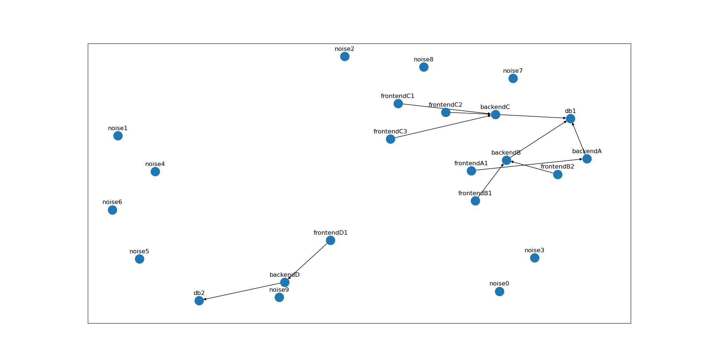

# Ghostpipe

Simulate alarmas in different architectures.

With Ghostpipe we could define an architecture of different servers interconnected and then simulate what
happens when some servers have problems, getting the events generated for each server.

It also generate a graph with the architecture (by default, ``graph.cyjs``).

We can use ``show_graph.py`` to show that graph.

Example graph generated with Ghostpipe and drawed with ``show_graph.py``:

Each server runs it's own goroutine, simulating the behaviour of a local monitoring agent
generating events when there is some problem.

The problems could be produced manually in the code and others are generated based on a relationships
between the servers. For example, a backend server will generate a ``DBConnectionAlarm`` if its database
is not available.
